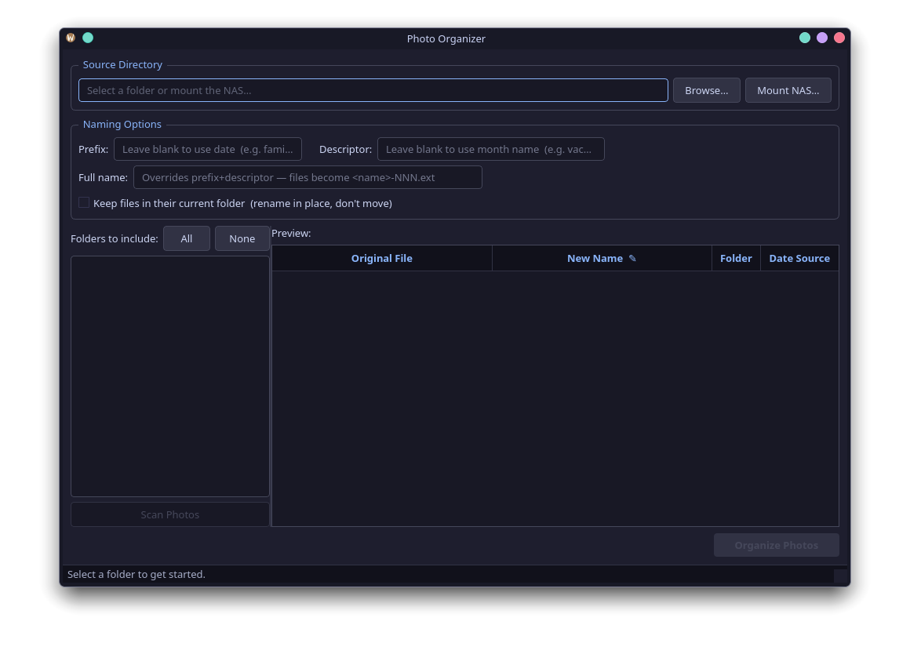

# Photo Organizer

A desktop app for organizing messy photo folders. Reads each photo's EXIF
date, groups them into monthly folders, and renames them with a consistent
pattern — so `IMG_1234.jpg`, `DSC_5678.png`, and friends turn into
`2025-08-august-001.jpg`, `2025-08-august-002.png`, etc.

Works on Windows, macOS, and Linux. **No Python or other dependencies
required** when using the pre-built executables.



## Features

- **EXIF-aware date detection** — falls back to file timestamps when a photo
  has no EXIF data (highlighted in the preview so you know)
- **Live preview** of every rename before any file is touched — nothing
  moves until you click *Organize*
- **Pick folders to include or exclude** with a checkbox tree, including
  nested subfolders
- **Three naming modes**:
  - Date-based (default): `2025-08-august-001.jpg`
  - Custom prefix or descriptor: `family-vacation-001.jpg`
  - Full custom name: `memories-001.jpg`
- **Manual per-file rename** — double-click any row in the preview to give
  one photo a custom name
- **Move into monthly folders** *or* **rename in place** (keep files where
  they are, just change the names)
- **Conflict detection** — duplicate names are highlighted in red and block
  the *Organize* button until resolved
- **NAS / SMB mount support** *(Linux only)* — connect to a network share
  without leaving the app
- **Stop scanning** mid-scan if you picked the wrong folder
- **Catppuccin Mocha theme**

## Install

### Option 1 — Download a pre-built executable (easiest)

Grab the latest binary for your platform from the
[Releases page](https://github.com/snikrep1/photo-organizer/releases/latest).

| Platform | File | How to run |
|----------|------|-----------|
| Windows  | `PhotoOrganizer.exe` | Double-click. Windows SmartScreen may warn you the publisher is unknown — click *More info* → *Run anyway*. |
| macOS    | `PhotoOrganizer-macos.zip` | Unzip, drag `PhotoOrganizer.app` to `/Applications`. **First launch:** right-click the app → *Open* (not double-click), then confirm. This is needed once because the app isn't signed by Apple. |
| Linux    | `photo-organizer` | Make it executable (`chmod +x photo-organizer`) then run it: `./photo-organizer`. |

That's it — no Python, no dependencies, nothing else to install.

### Option 2 — Build from source

Choose this if you want to modify the code, run on an unsupported platform,
or just don't want to trust the prebuilt binaries.

#### Prerequisites (all platforms)

- **Python 3.10 or newer** ([python.org/downloads](https://www.python.org/downloads/))
- **Git** ([git-scm.com](https://git-scm.com/downloads))

That's it. The build script handles everything else.

#### Step-by-step

##### 1. Clone the repo

```bash
git clone https://github.com/snikrep1/photo-organizer.git
cd photo-organizer
```

##### 2. Set up a virtual environment and install dependencies

This is the only step that's different per platform:

**Windows (PowerShell):**
```powershell
python -m venv .venv
.venv\Scripts\Activate.ps1
pip install pyinstaller PyQt6 Pillow
```

**Windows (Command Prompt):**
```cmd
python -m venv .venv
.venv\Scripts\activate.bat
pip install pyinstaller PyQt6 Pillow
```

**macOS / Linux:**
```bash
python3 -m venv .venv
source .venv/bin/activate
pip install pyinstaller PyQt6 Pillow
```

> On Linux you may also need the Qt system libraries. On Ubuntu/Debian:
> `sudo apt install libegl1 libxkbcommon-x11-0 libxcb-cursor0`.
> On Arch: `sudo pacman -S qt6-base` (usually already installed).

##### 3. Build the executable

```
python build.py
```

(Note: `python` on Windows, `python3` on macOS/Linux — but if your venv is
activated, either works.)

When the build finishes, your executable is in the `dist/` folder:

| Platform | Output |
|----------|--------|
| Windows  | `dist\PhotoOrganizer.exe` (single file, ~60 MB) |
| macOS    | `dist/PhotoOrganizer.app` (drag to `/Applications` to install) |
| Linux    | `dist/photo-organizer` (single file, ~130 MB) |

##### 4. Run it

**Windows:** double-click `dist\PhotoOrganizer.exe`

**macOS:** double-click `PhotoOrganizer.app`, *or* from the terminal:
`open dist/PhotoOrganizer.app`

**Linux:**
```bash
./dist/photo-organizer
```

#### Skip the build — just run the script

If you don't want a packaged executable, you can run the app directly from
Python after installing the runtime dependencies:

```bash
pip install PyQt6 Pillow
python photo_organizer.py      # Windows
python3 photo_organizer.py     # macOS / Linux
```

This is the fastest way if you're hacking on the code.

### Building all three platforms at once

PyInstaller cannot cross-compile — a Windows `.exe` must be built on
Windows, an `.app` on macOS, and so on. To produce all three from one
machine, push to GitHub: the workflow in `.github/workflows/build.yml`
builds Linux, Windows, and macOS in parallel on GitHub-hosted runners.
Trigger it manually from the *Actions* tab, or push a `v*` tag to also
attach the binaries to a GitHub Release.

## How to use

1. **Pick a source folder** — *Browse…* to a local folder, or *Mount NAS…*
   on Linux to mount an SMB share.
2. **Untick any subfolders** you don't want touched in the tree on the left.
3. **Click *Scan Photos*** — reads EXIF data in the background. *Stop
   Scanning* aborts if you picked the wrong place.
4. **Review the preview table** on the right. Old name → new name → folder.
   - Yellow rows = no EXIF data, dated from file timestamp
   - Lavender rows = manually renamed (double-click a *New Name* cell)
   - Red rows = naming conflict (must be resolved before organizing)
5. **Optional**: set a custom *Prefix*, *Descriptor*, or *Full name* — the
   preview updates live.
6. **Optional**: check *Keep files in their current folder* to rename in
   place instead of moving into `YYYY-MM/` subfolders.
7. **Click *Organize Photos*** — confirmation dialog, then it runs.

## Platform notes

- **Windows / macOS:** the NAS mount feature is hidden. Mount your SMB
  share through the OS (Explorer's *Map Network Drive*, or Finder's
  *Go → Connect to Server*), then point *Browse…* at the mounted location.
- **macOS Gatekeeper:** the `.app` is not signed by Apple, so the first
  launch needs the right-click → *Open* dance. After that it runs normally.
- **Linux NAS mount:** requires `cifs-utils` installed (`mount.cifs`) and
  `sudo` access. The app prompts for your sudo password in the dialog.

## Supported file types

`.jpg`, `.jpeg`, `.png`, `.heic`, `.heif`, `.tiff`, `.tif`, `.bmp`,
`.webp`, `.raw`, `.cr2`, `.nef`, `.arw`, `.dng`

`.jpeg` is normalized to `.jpg` in the output.

## License

GPL v3 — see [LICENSE](LICENSE).
